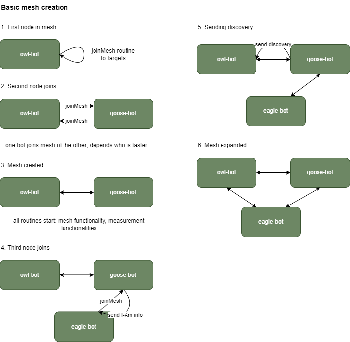
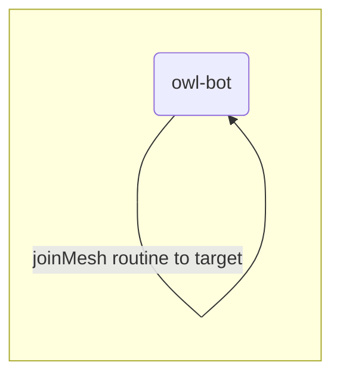
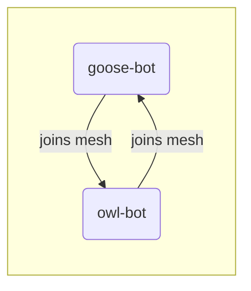
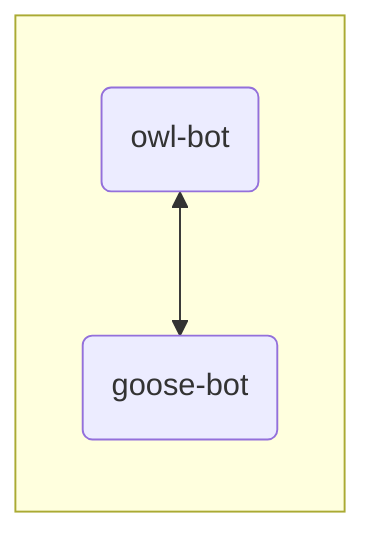
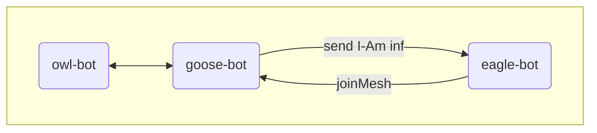
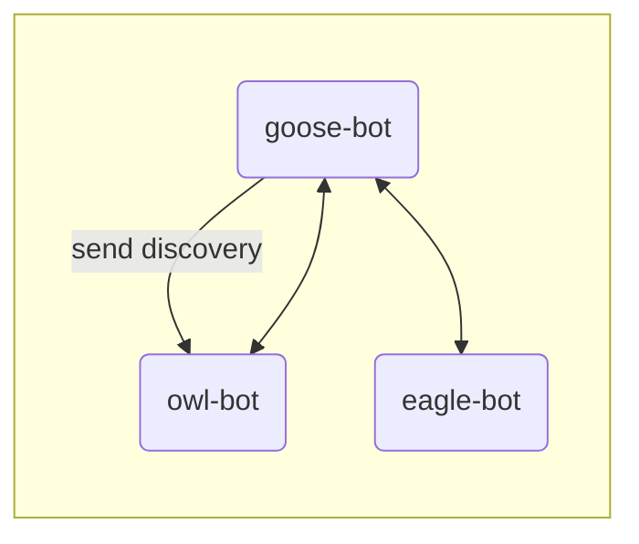
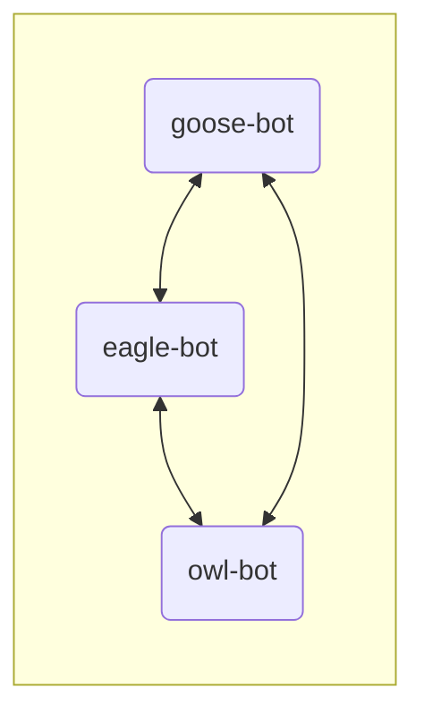

<h1 align="center">
    Canary Bot
</h1>

<p align="center">
    <a href="/../../commits/" title="Last Commit"></a>
    <a href="/../../issues" title="Open Issues"></a>
    <a href="./LICENSE" title="License"></a>
</p>

<p align="center">
  <a href="#development">Development</a> •
  <a href="#documentation">Documentation</a> •
  <a href="#support-and-feedback">Support</a> •
  <a href="#how-to-contribute">Contribute</a> •
  <a href="#licensing">Licensing</a>
</p>

Measurement of network status information of distributed systems in an HTTP-based communicating mesh.

## About this component

The Canary Bot is an HTTP-based (gRPC) communication executable measuring network data from node to node (Bot to Bot). Place one Canary Bot on each distributed host to create a mesh. Each bot will gather information about the network connectivity to each other.

Every bot exposes an API (REST and gRPC) for consuming measurement samples.
Each bot in the mesh provides measurement samples from every node.

Current measurement samples:

- Round-trip-time with TCP, TLS handshake and request
- Round-trip-time TCP request

## Installation

### By Source

Install it and use it with [Go SDK](https://golang.org/doc/install) by running `go install github.com/telekom/canary-bot`

Run the following cmd on your different dedicated hosts:

``` bash
# first host
canary-bot --name swan --target bird-goose.com:443 --ca-cert-path path/to/cert.cer --server-cert-path path/to/cert.cer --server-key ZWFzdGVyZWdn --join-address bird-swan.com:443 --listen-port 443

# ...

# second host
canary-bot --name goose --target bird-swan.com:443 --ca-cert-path path/to/cert.cer --server-cert-path path/to/cert.cer --server-key ZWFzdGVyZWdn --join-address bird-goose.com:443 --listen-port 443
```

Or try it on your localhost:

```bash
canary-bot --name eagle --target localhost:8082 --join-address localhost:8080 \
     --listen-address localhost --listen-port 8080 \
     --api-port 8081

# ...

canary-bot --name duck --target localhost:8080 --join-address localhost:8082 \
     --listen-address localhost --listen-port 8082 \
     --api-port 8083
```

### Binaries, Docker

<*coming soon*>

## Development

The project is divided into multiple modules you can use separately.

Use the main package to run the canary-bot out of the box. The package provides a default setup, can be built as a binary and run with configuration options define by CLI flags. Have a look at the [Installation](#installation)

Use the `mesh` module (`mesh/mesh.go`) to get your own canary-bot configuration running.

To create a Canary Bot use the `mesh.CreateCanaryMesh(/*RoutineConfiguration*/, /*SetupConfiguration*/)` and pass 2 different configurations.

### 1. Routine Configuration (`mesh/config.go@RoutineConfiguration`)

We provide a Standard Production Routine Configuration that is used by the default Canary-Bot.

```go
func StandardProductionRoutineConfig() *RoutineConfiguration {
 return &RoutineConfiguration{
  RequestTimeout:        time.Second * 3,
  JoinInterval:          time.Second * 3,
  PingInterval:          time.Second * 10,
  PingRetryAmount:       3,
  PingRetryDelay:        time.Second * 5,
  BroadcastToAmount:     2,
  PushSampleInterval:    time.Second * 5,
  PushSampleToAmount:    2,
  PushSampleRetryAmount: 2,
  PushSampleRetryDelay:  time.Second * 10,
  CleanupInterval:       time.Minute,
  CleanupMaxAge:         time.Hour * 24,

  RttInterval: time.Second * 3,
 }
}
```

Have look at the struct `RoutineConfiguration` and the func `StandardProductionRoutineConfig` for detailed information. Please checkout the [documentation](#documentation) below. below.

### 2. SetupConfiguration (`mesh/config.go@SetupConfiguration`)

Have look at the struct for detailed information. Please checkout the [documentation](#documentation) below.

## Code of Conduct

This project has adopted the [Contributor Covenant](https://www.contributor-covenant.org/) in version 2.1 as our code of conduct. Please see the details in our [CODE_OF_CONDUCT.md](CODE_OF_CONDUCT.md). All contributors must abide by the code of conduct.

## Working Language

We decided to apply *English* as the primary project language.

Consequently, all content will be made available primarily in English. We also ask all interested people to use English as language to create issues, in their code (comments, documentation etc.) and when you send requests to us. The application itself and all end-user facing content will be made available in other languages as needed.

## Documentation

### Terms & Definitions

Canary Bot: A single instance running on a dedicated system

Canary Mesh: Multiple Canary Bots connected to each other. Every Canary Bot manages its own mesh instance, knowing about the bots that are accessible by itself.

### Canary Mesh startup

 <!--   -->

#### 1. First node in mesh



#### 2. Second node joins



One bot joins mesh of the other; depends on who is faster

#### 3. Mesh created



All routines start: mesh functionality, measurement functionalities

#### 4. Third node joins



#### 5. Sending discovery



#### 6. Mesh expanded



### CLI options

Use the offered CLI options or use environment variables with a 'MESH' prefix e.g. Flag: `listen-address` -> Env: `MESH_LISTEN_ADDRESS`

| Flag             | Mandatory | Multi-use | Desc                                                                                                | Defaults                              |
| ---------------- | --------- | --------- | --------------------------------------------------------------------------------------------------- | ------------------------------------- |
| target           | x         | x         | Comma-separated or multi-flag list of targets for joining the mesh. Format: IP:PORT or ADDRESS:PORT | -                                     |
| name             | x         |           | Name of the node, has to be unique in mesh                                                          | -                                     |
| listen-address   |           |           | Address or IP the server of the node will bind to; eg. 0.0.0.0, localhost                           | outbound IP of the network interface  |
| listen-port      |           |           | Listening port of this node                                                                         | 8081                                  |
| join-address     |           |           | Address of this node; nodes in the mesh will use the domain to connect; eg. test.de, localhost      | outbound IP of the network interface  |
| api-port         |           |           | API port of this node                                                                               | 8080                                  |
| server-cert-path |           | x         | Path to the server cert file e.g. cert/server-cert.pem - use with server-key-path to enable TLS     | -                                     |
| server-key-path  |           |           | Path to the server key file e.g. cert/server-key.pem - use with server-cert-path to enable TLS      | -                                     |
| server-cert      |           |           | Base64 encoded server cert, use with server-key to enable TLS                                       | -                                     |
| server-key       |           |           | Base64 encoded server key, use with server-cert to enable TLS                                       | -                                     |
| ca-cert-path     |           |           | Path to ca cert file/s to enable TLS                                                                | -                                     |
| ca-cert          |           |           | Base64 encoded ca cert to enable TLS, support for multiple ca certs by ca-cert-path flag            | -                                     |
| token            |           | x         | Comma-separated or multi-flag list of tokens to protect the sample data API.                        | will be generated and print to stdout |
| cleanup-nodes    |           |           | Enable cleanup mode for nodes                                                                       | false                                 |
| cleanup-samples  |           |           | Enable cleanup mode for measurement samples                                                         | false                                 |
| debug            |           |           | Set logging to debug mode                                                                           | false                                 |
| debug-grpc       |           |           | Enable more logging for grpc                                                                        | false                                 |

### TLS Support

1. No TLS
   - nothing todo

2. Edge terminated TLS
   - Use case: E.g. in a Kubernetes Cluster with NGINX Ingress Controller
   - Client: needs CA Cert
   - Server: nothing todo, TLS is terminated before reaching server
   - use: `ca-cert` flag

3. E2E mutual TLS
   - Client: needs CA Cert
   - Server: needs Server Cert & Server Key
   - use: `ca-cert`, `server-cert`, `server-key` flags

## Support and Feedback

The following channels are available for discussions, feedback, and support requests:

| Type       | Channel                                                                                                                                                 |
| ---------- | ------------------------------------------------------------------------------------------------------------------------------------------------------- |
| **Issues** | <a href="/../../issues/new/choose" title="General Discussion"></a> |

## How to Contribute

Contribution and feedback is encouraged and always welcome. For more information about how to contribute, the project structure, as well as additional contribution information, see our [Contribution Guidelines](./CONTRIBUTING.md). By participating in this project, you agree to abide by its [Code of Conduct](./CODE_OF_CONDUCT.md) at all times.

## Licensing

Copyright (c) 2022 Deutsche Telekom IT GmbH.

Licensed under the **Apache License, Version 2.0** (the "License"); you may not use this file except in compliance with the License.

You may obtain a copy of the License at <https://www.apache.org/licenses/LICENSE-2.0>.

Unless required by applicable law or agreed to in writing, software distributed under the License is distributed on an "AS IS" BASIS, WITHOUT WARRANTIES OR CONDITIONS OF ANY KIND, either express or implied. See the [LICENSE](./LICENSE) for the specific language governing permissions and limitations under the License.
