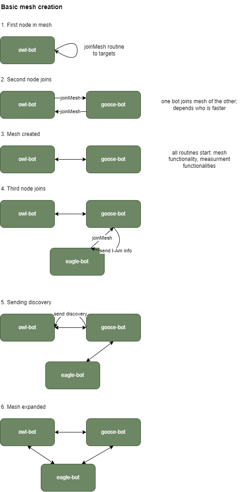

# Mesh



# Usage

Run `cbot --help` for futher information.

## the network

To separate different szenarios like starting the bot on a dedicated host or e.g. a Kubernetes cluster we introduced the `join-address` and `listen-address` flag.

JoinMesh Request to tell the joining mesh who I am - the public connection point:
`join-address` (optional; eg. test.de:443, localhost:8080) > external IP (form network interface)

Listen server address & port - the real listening settings of the grpc server:
`listen-address` (optional; eg. 10.34.0.10, localhost) > external IP (form network interface)

### 1. Szenario: Kubernetes cluster

[eade-terminating TLS - 2 targets - different join & listen address for Kubernetes szenario]

The kubernetes ingress controller will listen on bird-owl.com on port 443 (https). It redirects incomming http request via a service to the running pod listening to localhost on port 8080.

```
cbot --name owl --join-address bird-owl.com:443 --listen-adress localhost --listen-port 8080 --api-port 8081 -t bird-goose.com:443 -t bird-eagle.net:8080 --ca-cert-path path/to/cert.cer
```

### 2. Szenario: Dedicated host

[mutal TLS - 2 targets - join & listen-address is external IP from network interface]

The bot is running on a public ip (x.x.x.x) and listens on port 8081 for mesh requests.

```
cbot --name swan -t bird-goose.com:443 -t bird-eagle.net:8080 --ca-cert-path path/to/cert.cer --server-cert-path path/to/cert.cer --server-key ZWFzdGVyZWdn 
```

## TLS


1. No TLS

- nothing todo

2. edge terminated TLS

- eg. in a Kubenetes Cluster with NGINX Ingress Controller
- Client: needs CA Cert
- Server: nothing todo, TLS is terminated before reaching server
- use: `ca-cert` flag

2. e2e Mutal TLS

- Client: needs CA Cert
- Server: needs Server Cert & Server Key
- use: `ca-cert`, `server-cert`, `server-key` flags

# Logic

Have a deeper look at the canary logic [here](logic.md)

