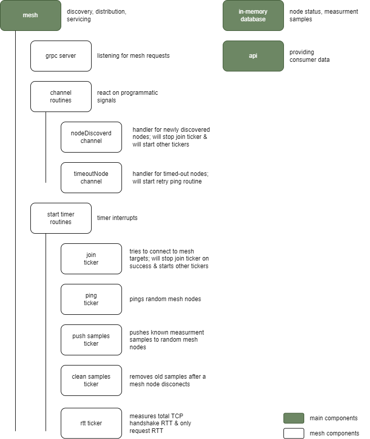

# Logic

## Startup

- init memory DB
- starting API
- starting mesh server (grpc)
  - listen on joinMesh
  - listen on ping
  - listen on nodeDiscovery
  - listen on pushSamples
  - listen on RTT
- starting joinMesh routine
- starting channelRoutines
  - init newNodeDiscovered channel
  - init timeoutNode channel
- starting timerRoutines if joinMesh is done
  - ping routine
  - sample routine
  - rtt routine

### Mesh server

1. joinMesh

- add node to mesh
- send newNodeDiscovered signal

2. ping

- add node to mesh (if not existed)

3. nodeDiscovery

- add node/s to mesh
- send newNodeDiscovered signal
- stop joinMesh routine

4. pushSamples

- safe/update samples

5. rtt

- just send emtpy response

### JoinMesh routine

1. start dialing targets to join existing mesh

### Ping routine

1. pings random x node/s
2. retry x times
3. send timeoutNode signal
4. timeout delay
5. timeout retry x times

### Sample routine

1. push sample to x random node/s
2. retry x times

### RTT routine

1. create new connection to random node
2. send RTT request
3. measure RTT with TCP handshake
4. measure RTT just request

### newNodeDiscovered channel

- send known nodes to x random node/s

### timeoutNode channel

- timeout delay
- timeout ping retry x times
- delete node from mesh

